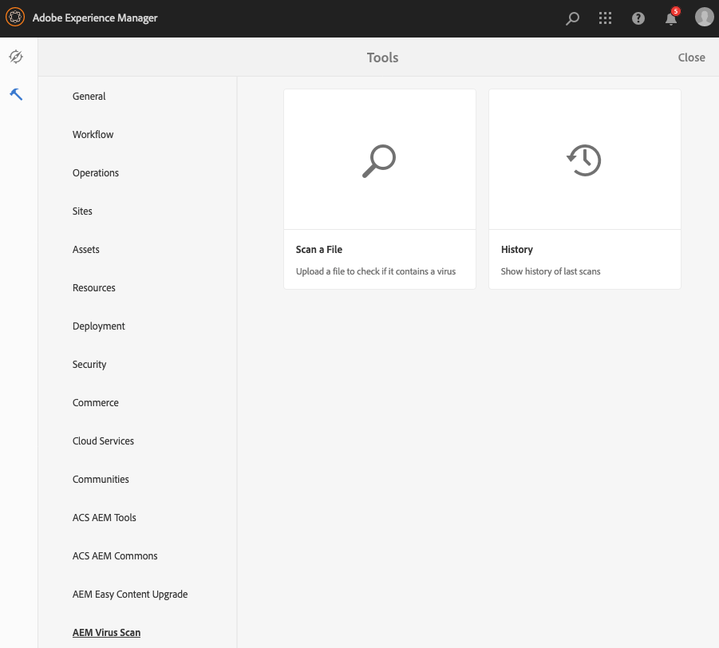
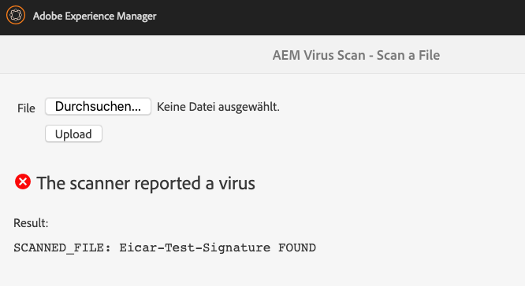
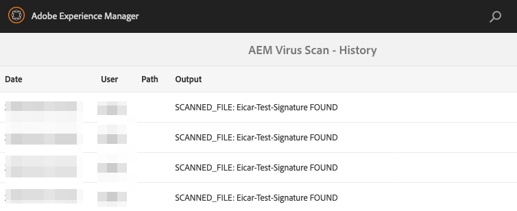
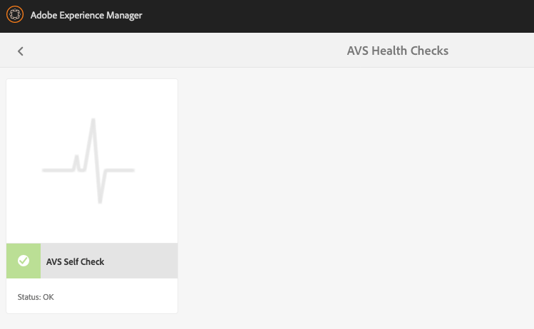

# AEM Virus Scan

AEM Virus Scan adds malware scanning to your AEM instance. It supports Clam AV out-of-the-box and can be extended to support more scan engines.

Features:

* Scanning of asset uploads
* API to run scan from custom code
* API to add custom scan engines
* Provided scan engines:
    * Clam AV
* Health checks

Sample test virus files can be downloaded at [eicar](http://eicar.com/).

Table of contents
1. [Requirements](#requirements)
2. [Installation](#installation)
3. [Scan File Uploads](#fileuploads)
4. [Tools](#tools)
5. [Configuration](#configuration)
6. [Health Checks](#healthchecks)
7. [API Documentation](#api)
8. [License](#license)
9. [Changelog](#changelog)
10. [Implement a Custom Scan Engine](#customScanner)
11. [Developers](developers#)


<a name="requirements"></a>

# Requirements

AVS requires Java 8 and AEM 6.5 or AEM Cloud. For older AEM versions see below.

| AEM Version   | AVS       |
| ------------- | --------- |
| 6.5/Cloud     | 2.x       |

## Older AEM versions


| AEM Version   | AVS       |
| ------------- | --------- |
| 6.4           | 1.x       |

<a name="installation"></a>

# Installation


## AEM 6.5 and AEM Cloud

### AEM 6.5

You can download the package from [Maven Central](https://repo1.maven.org/maven2/de/valtech/avs/avs.complete/) or our [releases section](https://github.com/valtech/aem-easy-content-upgrade/releases). The avs.complete package will install the AVS software.

```xml
        <dependency>
            <groupId>de.valtech.avs</groupId>
            <artifactId>avs.complete</artifactId>
            <version>LATEST</version>
            <type>zip</type>
        </dependency>
```

### AEM Cloud

You can download the package from [Maven Central](https://repo1.maven.org/maven2/de/valtech/avs/avs.complete.cloud/) or our [releases section](https://github.com/valtech/aem-easy-content-upgrade/releases). The avs.complete package will install the AVS software.

```xml
        <dependency>
            <groupId>de.valtech.avs</groupId>
            <artifactId>avs.complete.cloud</artifactId>
            <version>LATEST</version>
            <type>zip</type>
        </dependency>
```

## Older AEM Versions (<6.5/Cloud)

You can download the package from [Maven Central](https://repo1.maven.org/maven2/de/valtech/avs/avs.ui.apps/) or our [releases section](https://github.com/valtech/aem-virus-scan/releases). The avs.ui.apps package will install the AVS software.

```xml
        <dependency>
            <groupId>de.valtech.avs</groupId>
            <artifactId>avs.ui.apps</artifactId>
            <version>LATEST</version>
            <type>zip</type>
        </dependency>
```


## Uninstallation

The application can be removed by deleting the following paths:
* /apps/valtech/avs
* /apps/settings/granite/operations/hc/avs
* /conf/global/settings/granite/operations/maintenance/granite_weekly/avs_history_purge
* /home/users/system/avs
* /var/avs

Afterwards, you can delete the AVS packages in package manager.

<a name="fileuploads"></a>

# Scan File Uploads

You can scan files in any POST request. E.g. this way you can scan files that are uploaded to DAM.

You should provide a [configuration](#conf_filter) of the URL patterns for the filter.

<a name="tools"></a>

# Tools

AVS adds tools to the AEM menu.




## Perform a Manual Scan

You can upload a file using AVS scan tool from the menu. This allows you to check if there is an issue with the file.




## History

This shows the history of the last found infections. Scans that did not lead to an alert are not listed.



<a name="configuration"></a>

# Configuration

You can see an example for each configuration in [example package](/examples/src/main/content/jcr_root/apps/valtech/avs-examples/config).

<a name="conf_filter"></a>

## AVS Post Filter

This filter can scan e.g. asset uploads for viruses.
You will also need to configure "Day CQ Mail Service" (com.day.cq.mailer.DefaultMailService) for this.

* includePatterns: List of regular expressions to match the URLs to check. If empty, all non-excluded URLs are scanned.
* excludePatterns: List of regular expressions to match the URLs to ignore. Has higher priority than include patterns.

PID: de.valtech.avs.core.filter.AvsPostFilter

File name: de.valtech.avs.core.filter.AvsPostFilter.xml

```
<?xml version="1.0" encoding="UTF-8"?>
<jcr:root xmlns:sling="http://sling.apache.org/jcr/sling/1.0" xmlns:jcr="http://www.jcp.org/jcr/1.0" jcr:primaryType="sling:OsgiConfig"
   includePatterns="[/content/dam/.*]"
   excludePatterns="[]"
/>
```

<a name="conf_mail"></a>

## AVS Notification Mailer

This filter can scan e.g. asset uploads for viruses.

* subject: mail subject
* body: body for all virus notification emails. Wildcards are ${FILE_NAME} for uploaded file name and ${SCAN_OUTPUT} for scan details.
* isHtml: specifies if mail format is HTML or TEXT
* from: FROM address for notification emails
* additionalRecipients: additional email recipients

PID: de.valtech.avs.core.mail.AvsNotificationMailer

File name: de.valtech.avs.core.mail.AvsNotificationMailer.xml

```
<?xml version="1.0" encoding="UTF-8"?>
<jcr:root xmlns:sling="http://sling.apache.org/jcr/sling/1.0" xmlns:jcr="http://www.jcp.org/jcr/1.0" jcr:primaryType="sling:OsgiConfig"
   subject="A virus was found"
   body="Dear Sir or Madam,&lt;br&gt;&lt;br&gt;a virus was detected in your file upload.&lt;br&gt;&lt;br&gt;File name: ${FILE_NAME}&lt;br&gt;Scan report: ${SCAN_OUTPUT}"
   isHtml="{Boolean}true"
   from="no-reply@example.com"
   additionalRecipients="[root@localhost]"
/>
```

<a name="conf_engines"></a>

## Scan Engines

<a name="conf_clam"></a>

### Clam Scanning Engine (Local Installation)

This engine uses a locally installed Clam AV application on the AEM server. You need to provide a configuration for Clam AV in case you want to use this scan engine. If no configuration is provided then it will not be activated.

* command: command to scan a single file. The file name will be added at the end of the command.

PID: de.valtech.avs.core.service.scanner.ClamScannerEngine

File name: de.valtech.avs.core.service.scanner.ClamScannerEngine.xml

```
<?xml version="1.0" encoding="UTF-8"?>
<jcr:root xmlns:sling="http://sling.apache.org/jcr/sling/1.0" xmlns:jcr="http://www.jcp.org/jcr/1.0" jcr:primaryType="sling:OsgiConfig"
   command="/usr/local/bin/clamdscan --infected --no-summary"
/>
```

### Clam Scanning Engine (Network)

This engine calls Clam AV via network. This requires that you have an external server that runs Clam AV with open TCP port ("TCPSocket" setting). You need to provide a configuration for Clam AV in case you want to use this scan engine. If no configuration is provided then it will not be activated.

* host: Host of remote Clam scanning server.
* port: Port of remote Clam scanning server (e.g. 3310).
* timeout: Connection timeout in seconds.
* chunkSize: Chunk size that is acceptable for Clam.

PID: de.valtech.avs.core.service.scanner.ClamNetworkScannerEngine

File name: de.valtech.avs.core.service.scanner.ClamNetworkScannerEngine.xml

```
<?xml version="1.0" encoding="UTF-8"?>
<jcr:root xmlns:sling="http://sling.apache.org/jcr/sling/1.0" xmlns:jcr="http://www.jcp.org/jcr/1.0" jcr:primaryType="sling:OsgiConfig"
   host="localhost"
   port="3310"
   timeout="5"
   chunkSize="100000"
/>
```

<a name="conf_history"></a>

## Purge History

This configures how long to keep the scan history. Older entries will be purged with maintenance task.

PID: de.valtech.avs.core.maintenance.PurgeHistoryTask

File name: de.valtech.avs.core.maintenance.PurgeHistoryTask.xml

```
<?xml version="1.0" encoding="UTF-8"?>
<jcr:root xmlns:sling="http://sling.apache.org/jcr/sling/1.0" xmlns:jcr="http://www.jcp.org/jcr/1.0" jcr:primaryType="sling:OsgiConfig"
   daysToKeep="30"
/>
```

<a name="healthchecks"></a>

# Health Checks

Health checks show you the status of AVS. This includes its service user, scan engines and a test scan.
You can access them on the [status page](http://localhost:4502/libs/granite/operations/content/healthreports/healthreportlist.html/system/sling/monitoring/mbeans/org/apache/sling/healthcheck/HealthCheck/avsHealthCheckmBean).



<a name="api"></a>

# API Documentation

https://valtech.github.io/aem-virus-scan/

<a name="license"></a>

# License

The AVS tool is licensed under the [MIT LICENSE](LICENSE).

<a name="changelog"></a>

# Changelog

Please see our [history file](HISTORY).

<a name="customScanner"></a>

# Implement a Custom Scan Engine

Implementing a custom scan engine is quite simple. There is no need to patch this project. You can implement the service in your own bundle. Of course, a pull request is appreciated.

Please implement a new service that implements de.valtech.avs.api.service.scanner.AvsScannerEnine. The AVS engine will pick it up automatically when the service is started. You only need to implement a single method.

```
@Component(service = AvsScannerEnine.class, immediate = true)
public class MyScannerEngine implements AvsScannerEnine {

    @Override
    public ScanResult scan(InputStream content, String fileName) throws AvsException {
      ...
    }
```


<a name="developers"></a>

# Developers

See our [developer zone](docs/developers.md).
